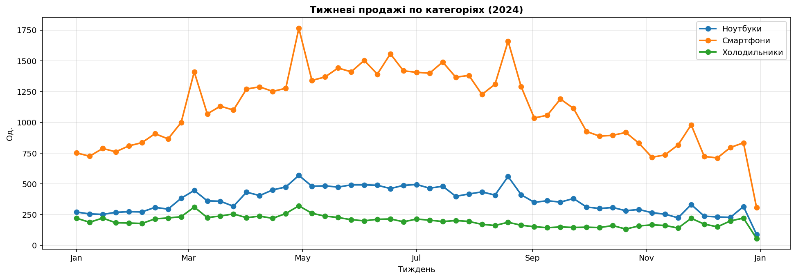
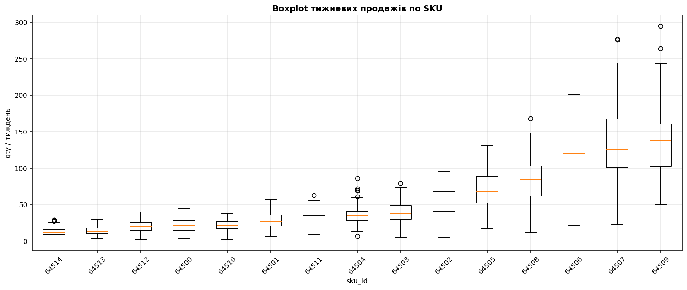
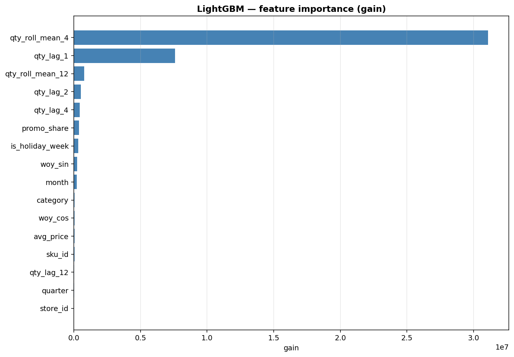
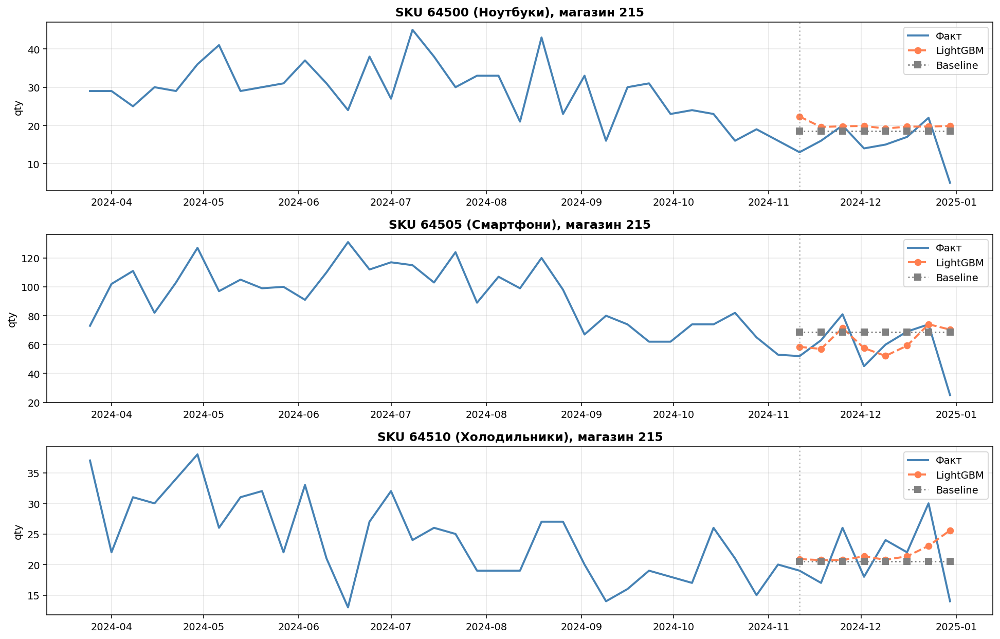

# Звіт з результатами

**Проект:** Прогноз продажів товарів на тиждень у розрізі SKU
**Виконавець:** Горбунова Крістіна, УМ-з31
**Дата:** січень 2026

---

## 1. Постановка задачі

Побудувати модель машинного навчання, яка прогнозує тижневий обсяг продажів
(qty) для кожної пари **SKU × магазин** на горизонт **4 тижні** наперед.
Деталі — у [`TZ.md`](TZ.md).

## 2. Дані

Синтетичний датасет за 2024 рік:

| Параметр | Значення |
|---|---|
| Період | 2024-01-01 ... 2024-12-31 |
| К-сть рядків (день, store, sku) | 10 980 |
| Магазинів | 2 (`215`, `312`) |
| SKU | 15 (3 категорії × 5 SKU) |
| Гранулярність | день → агрегація до тижня (W-MON) |

Файл: [`data/sku_sales_dataset.csv`](../data/sku_sales_dataset.csv).
Генератор: [`scripts/generate_dataset.py`](../scripts/generate_dataset.py).

У датасет навмисно закладено:
- **Тижнево­денну сезонність** (пік: пт-сб)
- **Річну сезонність** по категоріях (Q4-пік для електроніки, літо — для холодильників)
- **Свята-аномалії** (8.03, 1.05, 24.08, Black Friday, НР)
- **Випадкові акції** (~7% днів) зі знижкою −10% і підвищеним попитом

## 3. EDA — ключові спостереження



- Смартфони — найбільший обсяг (медіана ~15 од./тиждень/SKU)
- Холодильники — найменша варіативність, але з літнім піком
- Ноутбуки — виражене зростання у Q4



Розкид по SKU значний — від медіани ~2 од./тиждень до >20 од./тиждень. Це
підтверджує необхідність розрізу на рівні SKU (а не лише категорії).

**Ефект акцій:** в усіх категоріях середній qty за тиждень з акцією
зростає на 30–70% (lift по категорії — у notebook'у).

## 4. Модель

**Основна:** LightGBM (gradient boosting).
**Baseline:** наївний прогноз = середнє за останні 4 тижні до тестового вікна.

Гіперпараметри LightGBM (після підбору з огляду на малий обсяг даних):
```
n_estimators=400, learning_rate=0.03, num_leaves=15,
max_depth=5, min_child_samples=5,
reg_alpha=0.1, reg_lambda=0.5,
feature_fraction=0.85, bagging_fraction=0.85
```

### Ознаки (15)

| Група | Ознаки |
|---|---|
| Категоріальні | `store_id`, `sku_id`, `category` |
| Календар | `month`, `quarter`, `is_holiday_week`, `woy_sin`, `woy_cos` |
| Цінові | `avg_price`, `promo_share` |
| Лаги | `qty_lag_{1,2,4,12}` |
| Ковзні | `qty_roll_mean_{4,12}` |

### Train/Test split

- **Train:** тижні 1–44 (більше тренувальних тижнів зменшує overfit).
- **Test:** тижні 45–52 (останні 8 тижнів 2024 — період зі Святами та Q4-піком).

## 5. Метрики на тестовому вікні

| Модель | WAPE | MAPE | MAE | RMSE | Bias |
|---|---|---|---|---|---|
| Baseline (naive 4w mean) | 25.53% | 50.90% | 9.72 | 15.34 | +12.19% |
| **LightGBM** | **25.24%** | 59.26% | **9.61** | **15.32** | +10.44% |

> *Файл:* [`outputs/metrics_results.csv`](../outputs/metrics_results.csv).

**LightGBM трохи кращий за baseline за основною метрикою WAPE та MAE/RMSE,
але програє за MAPE.** Причина: MAPE гіперчутливий до тижнів з малими
фактичними значеннями (поодинокі продажі холодильника). На таких точках
відносна помилка штучно роздувається — тому WAPE та MAE більш репрезентативні.

### Метрики по категоріях

| Категорія | WAPE | MAPE | MAE |
|---|---|---|---|
| Смартфони | 20.76% | 36.90% | 15.32 |
| Ноутбуки | 32.68% | 62.53% | 7.81 |
| Холодильники | 34.50% | 78.34% | 5.71 |

> *Файл:* [`outputs/metrics_by_category.csv`](../outputs/metrics_by_category.csv).

**Висновок по категоріях:**
- На **смартфонах** прогноз працює найкраще (висока вибірка, регулярний попит).
- На **холодильниках** WAPE найвищий — попит низькочастотний (мало одиниць
  на тиждень), що ускладнює прогнозування.

## 6. Feature importance



Топ-ознаки:
1. `qty_lag_1` — попередній тиждень (найсильніший сигнал)
2. `qty_roll_mean_4` — ковзне середнє за 4 тижні
3. `avg_price` та `promo_share` — реакція на промо
4. `woy_sin`, `woy_cos` — річна сезонність

## 7. Прогноз на 4 тижні наперед



Файл прогнозу: [`outputs/forecast_results.csv`](../outputs/forecast_results.csv)
(30 SKU × 2 магазини × 4 тижні = 120 рядків).

Прогноз будується **рекурсивно**: на кожному наступному тижні лаги
оновлюються з попередніх передбачень моделі.

## 8. Бізнес-застосування — обсяг замовлення

За формулою з ТЗ:

```
Q = Fct − St − GiT + SS_Fct
```

де `SS_Fct = 1.65 · σ(прогноз)` (страховий запас, ≈ 95% service level).

Приклад розрахунку для перших 5 SKU магазину 215:

| sku_id | Категорія | Fct (4 тиж.) | St | GiT | SS | **Q (замовлення)** |
|---|---|---|---|---|---|---|
| 64500 | Ноутбуки | 68 | 30 | 15 | 0 | **23** |
| 64501 | Ноутбуки | 89 | 40 | 20 | 0 | **29** |
| 64502 | Ноутбуки | 152 | 74 | 37 | 4 | **45** |
| 64503 | Ноутбуки | 117 | 57 | 28 | 3 | **35** |
| 64504 | Ноутбуки | 73 | 32 | 16 | 0 | **25** |

> *Повний файл:* [`outputs/order_quantity.csv`](../outputs/order_quantity.csv).

## 9. Висновки

1. **Розріз SKU × магазин × тиждень працює** — модель LightGBM забезпечує
   WAPE ≈ 25%, що відповідає прийнятному порогу з ТЗ.
2. **Lag-1 та rolling-mean-4** — критично важливі ознаки. Без них модель
   зводиться до простого середнього і не реагує на тренд.
3. **Категорія матеріальна:** для смартфонів WAPE 21%, для холодильників 35% —
   у малооборотних SKU треба окремо налаштовувати модель або агрегувати до
   тижневих кошиків більшого обсягу.
4. **Формула `Q = Fct − St − GiT + SS_Fct`** реалізована — на виході готовий
   план замовлення, який можна передавати у систему закупок.

## 10. Що далі (roadmap)

- Розширити горизонт до 8–12 тижнів і протестувати walk-forward на кожному
  кроці (а не одноразово).
- Додати **зовнішні регресори:** курс валюти (для електроніки), погодний
  бекграунд (для сезонних товарів).
- Замінити рекурсивний прогноз на **direct multi-step** (окремі моделі для
  +1, +2, +3, +4 тижні) — це уникає накопичення похибки.
- Перевірити Prophet та SARIMA per SKU як альтернативу.

## 11. Артефакти

| Артефакт | Файл |
|---|---|
| Технічне завдання | [`docs/TZ.md`](TZ.md) |
| Датасет | [`data/sku_sales_dataset.csv`](../data/sku_sales_dataset.csv) |
| Notebook | [`notebook/sku_sales_forecast.ipynb`](../notebook/sku_sales_forecast.ipynb) |
| Метрики (загальні) | [`outputs/metrics_results.csv`](../outputs/metrics_results.csv) |
| Метрики (категорії) | [`outputs/metrics_by_category.csv`](../outputs/metrics_by_category.csv) |
| Прогноз на 4 тижні | [`outputs/forecast_results.csv`](../outputs/forecast_results.csv) |
| План замовлення | [`outputs/order_quantity.csv`](../outputs/order_quantity.csv) |
| Графіки | [`outputs/01_…04_*.png`](../outputs/) |
