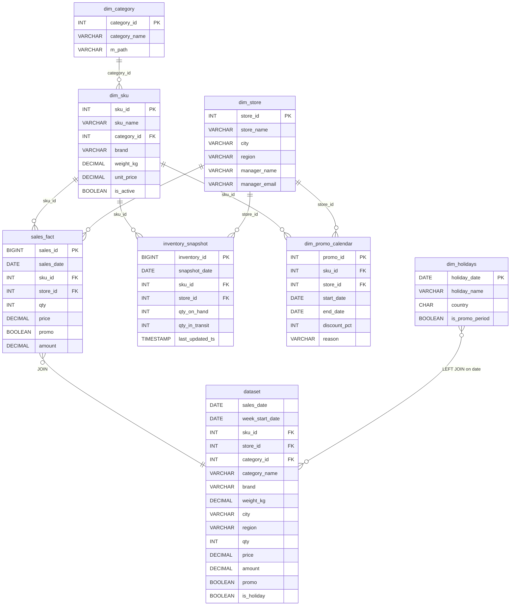

# Схема БД для Датасету прогнозування SKU

Розріз прогнозування: **продажу товарів у розрізі SKU × магазин × тиждень**.

Кінцева таблиця, яка йде в модель — **`dataset`** (View, побудоване через JOIN).

## ER-діаграма



## Опис таблиць

| Таблиця | Тип | Призначення | Розмір (sample) |
|---|---|---|---|
| `dim_category`       | dimension | довідник категорій товарів | 3 |
| `dim_sku`            | dimension | каталог SKU (товарів) | 15 |
| `dim_store`          | dimension | довідник магазинів / FC | 2 |
| `dim_holidays`       | dimension | календар свят | 11 |
| `dim_promo_calendar` | dimension | календар промо-акцій | 100 |
| `sales_fact`         | fact      | факт продажів | 100 |
| `inventory_snapshot` | fact      | щоденні залишки + товар у дорозі | 100 |
| **`dataset`**        | **view**  | **фінальна таблиця для моделі (JOIN всіх)** | **100** |

## Логіка побудови `dataset`

```text
sales_fact
   ├── INNER JOIN dim_sku          ON sku_id     ← беремо лише валідні SKU
   │        ├── INNER JOIN dim_category ON category_id
   │
   ├── INNER JOIN dim_store        ON store_id   ← беремо лише валідні магазини
   │
   ├── LEFT  JOIN dim_holidays     ON sales_date ← опціонально: прапор свята
   │
   └── (опц.) LEFT JOIN inventory_snapshot ← для формули замовлення
```

Деталі та SQL-код — у [`sql_queries.md`](sql_queries.md).

## Файли

| Артефакт | Файл |
|---|---|
| ER-діаграма (drawio) | [`db_schema.drawio`](db_schema.drawio) — відкрити на https://app.diagrams.net/ |
| ER-діаграма (mermaid) | цей файл, рендериться прямо в GitHub |
| SQL DDL + JOIN запит | [`sql_queries.md`](sql_queries.md) |
| Тестові дані (xlsx) | [`../data/db/db_sample_data.xlsx`](../data/db/db_sample_data.xlsx) |
| Тестові дані (csv)  | [`../data/db/`](../data/db/) — окремі файли |
| Генератор даних | [`../scripts/generate_db_tables.py`](../scripts/generate_db_tables.py) |
| Генератор схеми | [`../scripts/build_drawio_schema.py`](../scripts/build_drawio_schema.py) |

## Як відкрити `.drawio`

1. Перейти на https://app.diagrams.net/
2. **File → Open from → Device** → вибрати `docs/db_schema.drawio`
3. Або клік на файл у GitHub і кнопка **Edit with drawio** (якщо встановлено розширення)
